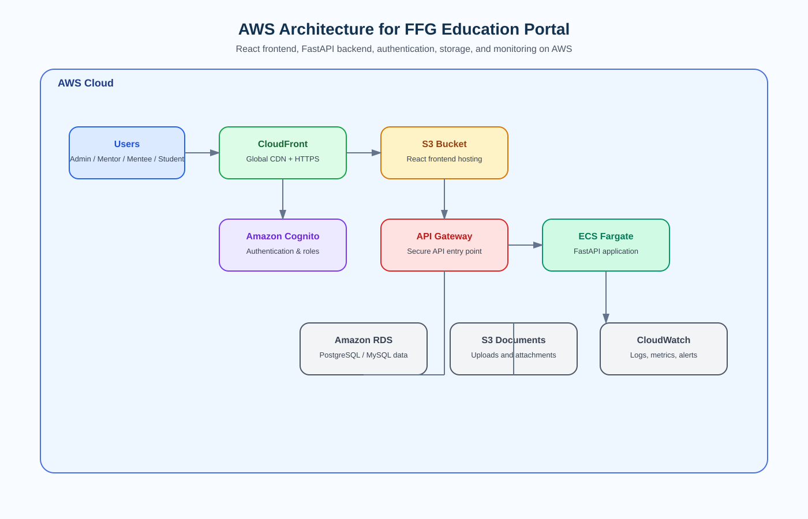

# Project EduAccess

A role-based education platform built with React frontend, FastAPI backend, and SQLite database.

## Architecture highlights
- Modular FastAPI backend with configuration, logging, and database abstraction support
- Component- and page-based React frontend with reusable API and auth services
- Environment-based configuration for backend and frontend
- Initial test coverage for backend and frontend

## Architecture diagram

This repository now includes an AWS-based cloud architecture for the education portal with:
- Amazon S3 + CloudFront for static frontend hosting
- Amazon Cognito for authentication and role-based access
- API Gateway + ECS Fargate for the FastAPI backend
- Amazon RDS for relational data storage
- Amazon S3 for document uploads and attachments
- Amazon CloudWatch for monitoring and logging

## Cloud deployment options

| Layer | Feature / requirement | AWS | Azure | GCP | Other Vendors |
|---|---|---|---|---|---|
| Frontend | User login / signup UI | Amazon Cognito + S3/CloudFront | Azure AD B2C + Static Web Apps | Google Identity Platform + Cloud Storage | Supabase Auth + Vercel |
| Backend | Role-based dashboards | ECS / App Runner | Azure App Service | Cloud Run | Render / Railway |
| Backend | Admin approval / moderation | ECS / Lambda + RDS | App Service + Azure Database | Cloud Run + Cloud SQL | Render + Supabase |
| Backend | Notices / announcements | ECS / App Runner | App Service | Cloud Run | Render |
| Backend | Application submission / tracking | Lambda + API Gateway + RDS | Functions + Azure Database | Cloud Functions + Cloud SQL | Supabase + Vercel Functions |
| Storage | File uploads / documents | S3 | Azure Blob Storage | Cloud Storage | Supabase Storage |
| Security / Access | Secure public access | Route 53 + ACM | Azure DNS + SSL | Cloud DNS + SSL | Cloudflare + Vercel domains |

## Project structure
- backend/: FastAPI app and tests
- frontend/: React app and page components
- .env.example: shared environment template
- .gitignore: standard ignore rules for Python and Node projects

## Getting started

### Backend
1. Go to backend
2. Install dependencies: `pip install -r requirements.txt`
3. Copy `.env.example` to `.env` and adjust values if needed
4. Start the API: `uvicorn app.main:app --reload`

### Frontend
1. Go to frontend
2. Install dependencies: `npm install`
3. Copy `.env.example` to `.env` and adjust values if needed
4. Start the app: `npm start`

## Testing
- Backend: `pytest -q`
- Frontend: `npm test -- --watchAll=false`

## Notes
- The current backend uses SQLite for simplicity, but the database layer is now structured to make a future move to MySQL or another SQL backend much easier.
